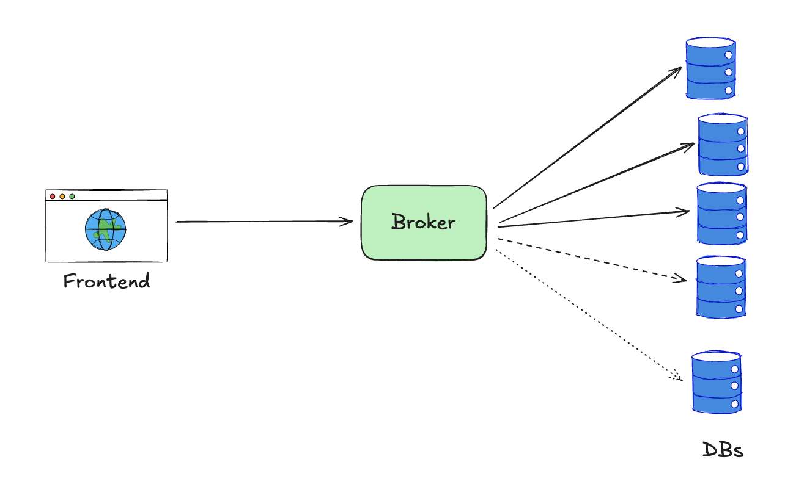

# Backend Engineering Technical Interview

# **Coding Challenge (go)**

Use the in-memory order book.
```bash
go run .
```

Update [main.go](./main.go) to play with the orderbook.

Potential improvements:
- Add order validation (example: prevent negative quantities, zero prices, ...).
- Add async publishing to a message broker.

# **Technical Discussion on a Previous Project**

## Project: Upgrading DBaaS from Docker Swarm to Kubernetes

### Problem
Six years ago, I joined a team managing a Database-as-a-Service (DBaaS).  
The platform was running on **Docker Swarm** (common at the time) with a chaotic architecture and many manual processes.

We supported deployments across **3 geographical regions** and **3 different database engines** (MongoDB, Redis, MySQL).  
For example:  
- A user could request a MongoDB cluster with 9 nodes (3 nodes per region).  
- Or a Redis cluster with 3 nodes in a single region of his choice.

**Legacy Architecture**  


**Challenges:**
- **Scaling:** Upgrading from a single instance to a clustered setup was manual.  
  We tried to automate this, but we failed. In practice, we would:  
  1. Create a new cluster with the required number of nodes.  
  2. Run a full data migration (which could take hours).  
  3. Switch over to the new database.
- **Version upgrades:** We built a tool for periodic upgrades, but a full fleet upgrade took days. And some users wanted specific database versions. Manually, we added them to an ignored list in the tool.
- **Operational Chaos:** We built many customised tools. One to detect unused databases, one to monitor failing nodes, etc.

### Solution
Redesigning the product on Kubernetes using the operator pattern. I used/maintained open source controllers that managed the full lifecycle of DB instances, example for redis: https://github.com/OT-CONTAINER-KIT/redis-operator. 

**New Architecture**  


**Key Improvements:**

- **Declarative Model:**  
  Users could request changes simply by updating parameters (e.g., `replicas: N`, `version: X`). No manual intervention required.

- **Automation:**
  The operator handles cluster creation, replication setup, failover, backups, scaling, and rolling upgrades end-to-end.

- **Reliability:**  
  Users had full control. No need to perform risky, repetitive operations on each database individually.

- **Monitoring:**  
  Integrated Prometheus, Grafana, and Alertmanager. Customers could track metrics (latency, storage usage, etc.) in Grafana. We received proactive alerts via Alertmanager.